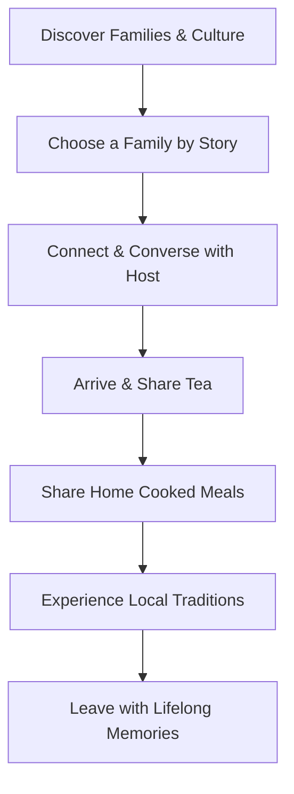

# LocalNest: The Digital Home of Real India

> **North Star:** LocalNest exists to help people discover the real India through the people who live it every day. Every home has a story. Every family has a tradition. Every journey should create a genuine human connection.

---

## 📖 The LocalNest Manifesto

The world already knows India's monuments—the Taj Mahal, Jaipur, Goa, Kerala, and the Himalayas. But they don't know:
*   The grandmother who has cooked the same recipe for 50 years.
*   The village where everyone gathers for evening tea.
*   The family preparing for Diwali together.
*   The morning sounds of a rural courtyard.
*   The stories an elder tells about the village's history.
*   The local artisan who learned weaving from their parents.

This is the India LocalNest introduces. 

### Our Mission
Help every traveler experience India through the people who call it home—not through guidebooks, influencers, or hotels, but through families.

### Our Vision
When travelers visit India, it is because they want to understand it. LocalNest becomes the bridge.

---

## 🤝 Core Values

*   **Human Connection:** Meet people before places.
*   **Authentic Hospitality:** Stay in real homes, not staged spaces.
*   **Homemade Food:** Share meals that families actually cook.
*   **Living Culture:** Experience traditions as they're practiced.
*   **Storytelling:** Hear the stories behind homes, families, and communities.
*   **Respectful Tourism:** Travel in ways that support local communities and traditions.

---

## 🗺 The User Journey



---

## 🛠 Product Development Workflow & Principles

Before adding any feature, we ask:
1. *Does this help travelers understand India better?*
2. *Does this help local families share their lives respectfully?*
3. *Does this build trust?*
4. *Does this encourage genuine connection?*
5. *Does this make the experience more human?*

*If the answer is no, we don't build it.*

---

## Technical Stack

- **Backend:** Python 3.13, Django 5, Django REST Framework
- **Frontend:** HTML5, CSS3, Bootstrap 5, Leaflet (OpenStreetMap integration)
- **Database:** PostgreSQL (Production), SQLite (Local Fallback)
- **Asset Storage:** Cloudinary
- **Deployment:** Railway, Gunicorn, WhiteNoise

---

## Getting Started

### Prerequisites
- Python 3.13.x installed on your local machine
- Git installed

### 1. Clone & Set Up Directory
```bash
git clone <repository-url>
cd localnest
```

### 2. Set Up Virtual Environment
On Windows (PowerShell):
```powershell
python -m venv venv
venv\Scripts\Activate.ps1
```
On macOS / Linux:
```bash
python3 -m venv venv
source venv/bin/activate
```

### 3. Install Dependencies
```bash
pip install -r requirements.txt
```

### 4. Setup Environment File (`.env`)
Create a `.env` file in the project root:
```ini
SECRET_KEY=django-insecure-your-secret-key-here
DEBUG=True
ALLOWED_HOSTS=localhost,127.0.0.1

# Optional Cloudinary Setup (defaults to local file storage if left empty)
CLOUDINARY_CLOUD_NAME=your-cloud-name
CLOUDINARY_API_KEY=your-api-key
CLOUDINARY_API_SECRET=your-api-secret

# Optional Payout / Razorpay Integration
RAZORPAY_KEY_ID=
RAZORPAY_KEY_SECRET=
```

### 5. Run Migrations & Setup Default Admin
Compile the database tables:
```bash
python manage.py migrate
```

Initialize default amenities (Optional but recommended):
Start Python shell: `python manage.py shell`
```python
from properties.models import Amenity
for name, icon in [('Wi-Fi', 'bi-wifi'), ('Hot Water', 'bi-droplet-half'), ('Air Conditioning', 'bi-snow'), ('Washing Machine', 'bi-box-seam'), ('Parking', 'bi-car-front')]:
    Amenity.objects.get_or_create(name=name, icon=icon)
```

Create an administrator superuser:
```bash
python manage.py createsuperuser
```
Follow the prompts to enter username, email, and password. Log in to `/admin` to approve host verifications or property listings manually.

### 6. Run the Application
```bash
python manage.py runserver
```
Visit the app locally at: [http://127.0.0.1:8000/](http://127.0.0.1:8000/)

---

## Project Structure & Architecture

```
localnest/
│
├── accounts/          # Custom User, Tourist & Host Profiles, signup/login
├── properties/        # Homestays listings, search, Leaflet/OSM maps, amenities
├── bookings/          # Calendar bookings, pricing, approval workflow
├── payments/          # Payment abstractions (Cash on Arrival, Razorpay placeholders)
├── reviews/           # Multi-criteria reviews (Food, Cleanliness, Host, Culture)
├── chat/              # Peer-to-peer AJAX-based communication
├── notifications/     # Platform-wide unread notifications triggers
├── core/              # Homepage, robots.txt, sitemap.xml, SEO tags
├── dashboard/         # Role-based dashboards (Tourist, Host, Admin Control)
│
├── static/            # Global stylesheet overrides and assets
└── templates/         # Global template layouts & components
```

---

## Deployment Guide (Railway)

1. **Sign up / Sign in** to [Railway.app](https://railway.app/).
2. Click **New Project** -> **Deploy from GitHub repo**.
3. Choose the repository containing this project.
4. Add a **PostgreSQL Database** resource on Railway. Railway automatically injects the `DATABASE_URL` environment variable.
5. In the service settings, add the following configuration variables:
   - `SECRET_KEY` (a secure random string)
   - `DEBUG` = `False`
   - `ALLOWED_HOSTS` = `your-railway-app-domain.railway.app`
   - `CLOUDINARY_CLOUD_NAME` / `CLOUDINARY_API_KEY` / `CLOUDINARY_API_SECRET`
6. Click **Deploy**. Railway will build the app using the configuration in `runtime.txt`, `requirements.txt`, and start Gunicorn via the `Procfile`.
