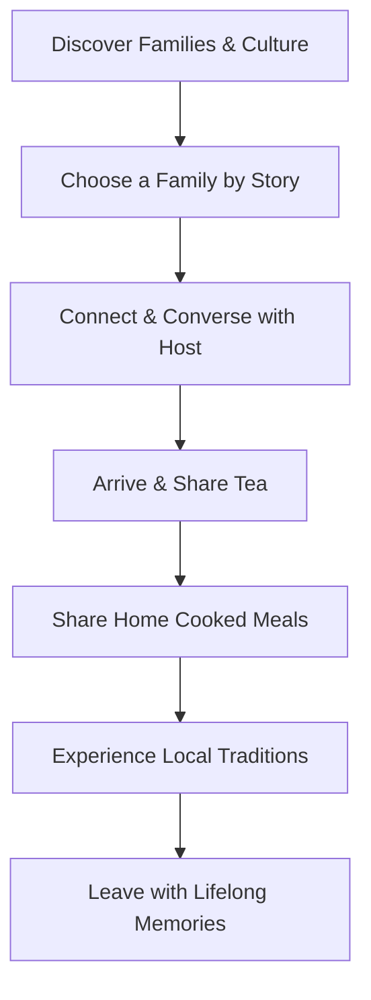

# LocalNest: The Digital Home of Real India

> **North Star:** LocalNest exists to help people discover the real India through the people who live it every day. Every home has a story. Every family has a tradition. Every journey should create a genuine human connection.

---

## 📖 The LocalNest Manifesto

The world already knows India's monuments—the Taj Mahal, Jaipur, Goa, Kerala, and the Himalayas. But they don't know:
*   The grandmother who has cooked the same recipe for 50 years.
*   The village where everyone gathers for evening tea.
*   The family preparing for Diwali together.
*   The morning sounds of a rural courtyard.
*   The stories an elder tells about the village's history.
*   The local artisan who learned weaving from their parents.

This is the India LocalNest introduces. 

### Our Mission
Help every traveler experience India through the people who call it home—not through guidebooks, influencers, or hotels, but through families.

### Our Vision
When travelers visit India, it is because they want to understand it. LocalNest becomes the bridge.

---

## 🤝 Core Values

*   **Human Connection:** Meet people before places.
*   **Authentic Hospitality:** Stay in real homes, not staged spaces.
*   **Homemade Food:** Share meals that families actually cook.
*   **Living Culture:** Experience traditions as they're practiced.
*   **Storytelling:** Hear the stories behind homes, families, and communities.
*   **Respectful Tourism:** Travel in ways that support local communities and traditions.

---

## 🗺 The User Journey



---

## 🛠 Product Development Workflow & Principles

Before adding any feature, we ask:
1. *Does this help travelers understand India better?*
2. *Does this help local families share their lives respectfully?*
3. *Does this build trust?*
4. *Does this encourage genuine connection?*
5. *Does this make the experience more human?*

*If the answer is no, we don't build it.*

---

## Technical Stack

- **Backend:** Python 3.13, Django 5, Django REST Framework
- **Frontend:** HTML5, CSS3, Bootstrap 5, Leaflet (OpenStreetMap integration)
- **Database:** PostgreSQL (Production), SQLite (Local Fallback)
- **Asset Storage:** Cloudinary
- **Deployment:** Railway, Gunicorn, WhiteNoise

---

## Getting Started

### Prerequisites
- Python 3.13.x installed on your local machine
- Git installed

### 1. Clone & Set Up Directory
```bash
git clone <repository-url>
cd localnest
```

### 2. Set Up Virtual Environment
On Windows (PowerShell):
```powershell
python -m venv venv
venv\Scripts\Activate.ps1
```
On macOS / Linux:
```bash
python3 -m venv venv
source venv/bin/activate
```

### 3. Install Dependencies
```bash
pip install -r requirements.txt
```

### 4. Setup Environment File (`.env`)
Create a `.env` file in the project root:
```ini
SECRET_KEY=django-insecure-your-secret-key-here
DEBUG=True
ALLOWED_HOSTS=localhost,127.0.0.1

# Optional Cloudinary Setup (defaults to local file storage if left empty)
CLOUDINARY_CLOUD_NAME=your-cloud-name
CLOUDINARY_API_KEY=your-api-key
CLOUDINARY_API_SECRET=your-api-secret

# Optional Payout / Razorpay Integration
RAZORPAY_KEY_ID=
RAZORPAY_KEY_SECRET=
```

### 5. Run Migrations & Setup Default Admin
Compile the database tables:
```bash
python manage.py migrate
```

Initialize default amenities (Optional but recommended):
Start Python shell: `python manage.py shell`
```python
from properties.models import Amenity
for name, icon in [('Wi-Fi', 'bi-wifi'), ('Hot Water', 'bi-droplet-half'), ('Air Conditioning', 'bi-snow'), ('Washing Machine', 'bi-box-seam'), ('Parking', 'bi-car-front')]:
    Amenity.objects.get_or_create(name=name, icon=icon)
```

Create an administrator superuser:
```bash
python manage.py createsuperuser
```
Follow the prompts to enter username, email, and password. Log in to `/admin` to approve host verifications or property listings manually.

### 6. Run the Application
```bash
python manage.py runserver
```
Visit the app locally at: [http://127.0.0.1:8000/](http://127.0.0.1:8000/)

---

## Project Structure & Architecture

```
localnest/
│
├── accounts/          # Custom User, Tourist & Host Profiles, signup/login
├── properties/        # Homestays listings, search, Leaflet/OSM maps, amenities
├── bookings/          # Calendar bookings, pricing, approval workflow
├── payments/          # Payment abstractions (Cash on Arrival, Razorpay placeholders)
├── reviews/           # Multi-criteria reviews (Food, Cleanliness, Host, Culture)
├── chat/              # Peer-to-peer AJAX-based communication
├── notifications/     # Platform-wide unread notifications triggers
├── core/              # Homepage, robots.txt, sitemap.xml, SEO tags
├── dashboard/         # Role-based dashboards (Tourist, Host, Admin Control)
│
├── static/            # Global stylesheet overrides and assets
└── templates/         # Global template layouts & components
```

---

## 🚀 Deployment Guide (Render)

LocalNest is configured for [Render.com](https://render.com) using the included `render.yaml`.

### Prerequisites
- A **Render** account (free tier works)
- A **Cloudinary** account (free tier — for media/photo uploads)
- Your project pushed to **GitHub**

---

### Step 1: Generate a Production SECRET_KEY
```bash
python -c "from django.core.management.utils import get_random_secret_key; print(get_random_secret_key())"
```
Copy this value — you'll need it in Render.

### Step 2: Deploy on Render

**Option A — Auto (render.yaml)**
1. Push this repo to GitHub
2. Go to [dashboard.render.com](https://dashboard.render.com) → **New** → **Blueprint**
3. Connect your GitHub repo — Render will read `render.yaml` and create both the Web Service and PostgreSQL database automatically

**Option B — Manual**
1. Go to Render → **New Web Service** → connect your GitHub repo
2. Configure:
   - **Build Command:** `pip install -r requirements.txt && python manage.py collectstatic --noinput && python manage.py migrate`
   - **Start Command:** `gunicorn localnest.wsgi --log-file - --workers 2 --timeout 120`
3. Create a **PostgreSQL** service on Render and link it

### Step 3: Set Environment Variables in Render Dashboard

| Variable | Value |
|---|---|
| `SECRET_KEY` | Your generated secret key |
| `DEBUG` | `False` |
| `ALLOWED_HOSTS` | `your-app.onrender.com` |
| `CSRF_TRUSTED_ORIGINS` | `https://your-app.onrender.com` |
| `DATABASE_URL` | Auto-set by Render PostgreSQL |
| `CLOUDINARY_CLOUD_NAME` | From Cloudinary dashboard |
| `CLOUDINARY_API_KEY` | From Cloudinary dashboard |
| `CLOUDINARY_API_SECRET` | From Cloudinary dashboard |
| `EMAIL_HOST_USER` | Your Gmail address |
| `EMAIL_HOST_PASSWORD` | Your Gmail App Password |

### Step 4: Create Admin User
After first deploy, open Render Shell and run:
```bash
python manage.py createsuperuser
```
Use strong credentials — **never use development passwords in production**.

### Step 5: Verify
- Visit `https://your-app.onrender.com/health/` → should return `{"status": "ok"}`
- Visit `https://your-app.onrender.com/` → homepage should load styled
- Visit `https://your-app.onrender.com/admin/` → Django admin should work

---

## 📁 Media / User Uploads

LocalNest uses **Cloudinary** for all user-uploaded media in production:
- Property photos
- Profile photos
- Story photos
- Recipe photos

When `CLOUDINARY_CLOUD_NAME`, `CLOUDINARY_API_KEY`, and `CLOUDINARY_API_SECRET` are set, Django automatically routes all media uploads to Cloudinary.

**Without Cloudinary** (local dev): uploads go to the `media/` folder on disk.

---

## 🗄️ Database

- **Development:** SQLite (`db.sqlite3`) — used when `DATABASE_URL` is not set
- **Production:** PostgreSQL — set `DATABASE_URL` env var

Migrations run automatically as part of the build command.

To run manually:
```bash
python manage.py showmigrations  # check status
python manage.py migrate         # apply
```

---

## 🔁 Rollback

Each Render deploy creates a snapshot. To rollback:
1. Go to Render Dashboard → your Web Service → **Deploys**
2. Click any previous deploy → **Rollback to this deploy**

Git checkpoint before current deployment: `97fb59d`

---

## 🐛 Troubleshooting

| Problem | Fix |
|---|---|
| Unstyled page | Run `collectstatic` — check `STATIC_ROOT` and WhiteNoise config |
| 500 on migrations | Check `DATABASE_URL` is set correctly in Render |
| Images not loading | Set Cloudinary credentials in Render env vars |
| CSRF errors | Add your domain to `CSRF_TRUSTED_ORIGINS` |
| `DisallowedHost` | Add your domain to `ALLOWED_HOSTS` |
| Static 404 | Ensure `WhiteNoiseMiddleware` is second in `MIDDLEWARE` |

---

## 🏥 Health Check

`GET /health/` returns `{"status": "ok", "service": "LocalNest"}` — used by Render for uptime monitoring.

---

## ⚠️ Payments

The **online (Razorpay) payment flow is currently simulated** for development purposes.
- **Cash on Arrival** is the recommended production payment method — it works fully end-to-end.
- Real Razorpay integration requires a Razorpay account and API keys (separate implementation task).

